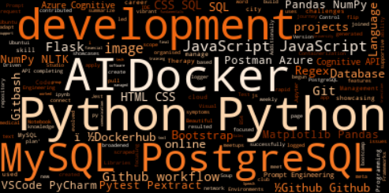

### [annwyl21.github.io](https://annwyl21.github.io)
### [dockerhub/annwyl21](https://hub.docker.com/repositories/annwyl21)

# Ellen Houghton

*Wordcloud created dynamically using text scraped from my cv html page*

***
I am looking for my first job as a junior software developer.

**Programming Languages:**
- Python
- JavaScript
- SQL
- HTML
- CSS

**Database Management:**
- MySQL
- MySQL Workbench
- PostgreSQL (Docker Image)
- Mongo DB
- MongoDB Compass

**Version Control & Containerization:**
- Git
- Github Version Control
- Github Actions & Projects
- Ubuntu/WSL
- Docker & Dockerhub
- GitBash

**Frameworks & Libraries:**
- Pytest
- Pextract
- Jest
- Flask
- Matplotlib
- Pandas
- NumPy
- NLTK
- Rehex
- Bootstrap
- Beautiful Soup (BS4)

**Development Environments/IDEs:**
- Visual Studio Code (VSCode)
- PyCharm
- Jupyter Notebook

**APIs & AI Engineering:**
- Python Requests
- Azure Cognitive API
- AI Prompt Engineering
- Postman

**Agile Development:**
- Agile

**Collaboration & Communication Tools:**
- Miro
- Mimeo
- Webex
- Zoom
- Menti
- Slack
- Discord
- Signal
- Teams
